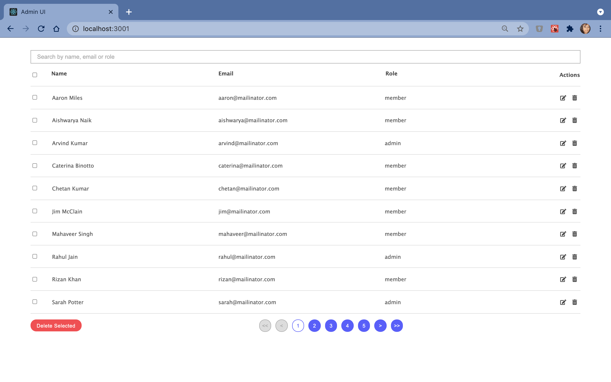

# Admin UI (Geektrust Frontend Coding Challenge)

This application is a front-end project which is designed as part of the [coding challenge](https://www.geektrust.in/coding-problem/frontend/adminui) at [Geektrust](https://www.geektrust.in/).

[**View Demo**](https://srishti-geektrust-admin-ui.netlify.app/)

## Table of Contents

1. [Overview](#overview)
2. [Installation](#installation)
3. [Key Features](#key-features)
4. [Bootstrapping](#bootstrapping)

## Overview

Admin UI is an application that displays an admin view containing a data table. The table displays the name, email and role of users. The admin can perform operations such as view all users, edit a user, delete single user, select multiple users and delete all selected users at a time. All the user data is displayed page-wise where each page displays a maximum of 10 users. The admin has options to, if possible, jump to the first/last/previous/next page.

## Installation

1. Fork this repository on GitHub to add it to your own GitHub account.
2. Clone the repository from your GitHub account to your local machine.
3. Go inside the application's directory on your local machine.
4. Install all packages using the following command:\
   `npm i`
5. Run the application using the following command:\
   `npm start`

The application will be run in the development mode.\
Open [http://localhost:3000](http://localhost:3000) to view it in the browser.

The page will reload if you make edits.\
You will also see any lint errors in the console.

## Features

### **Debouncing on Search**

The search feature is implemented using debouncing for 500 miliseconds. This implies that a keyword is not searched until a user stops typing and waits for atleast 500 miliseconds to see the search results. Debouncing ensures that an event is not unnecessarily fired too frequently.

### Error Handling

The `ErrorBoundary` component helps in catching an error in a component and displays the message "Something went wrong!" when a particular component encounters any error while rendering the other components properly. It also logs the error and its related information to the console for more details.

### **Responsiveness**

The entire application is responsive to devices of varied dimensions.

### Documentation

The code is well documented for the author and other developers to understand.

## Bootstrapping

This app was bootstrapped with [Create React App](https://github.com/facebook/create-react-app).
